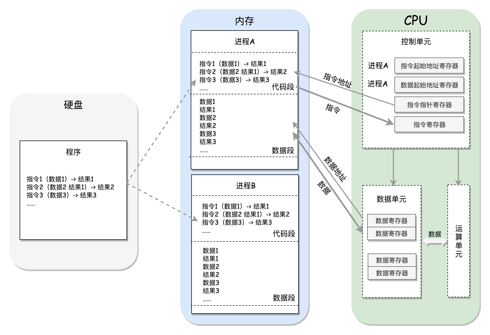
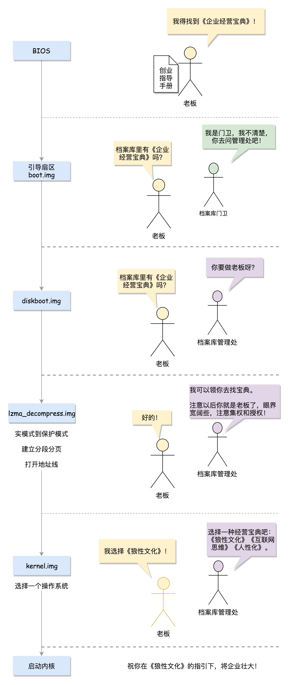
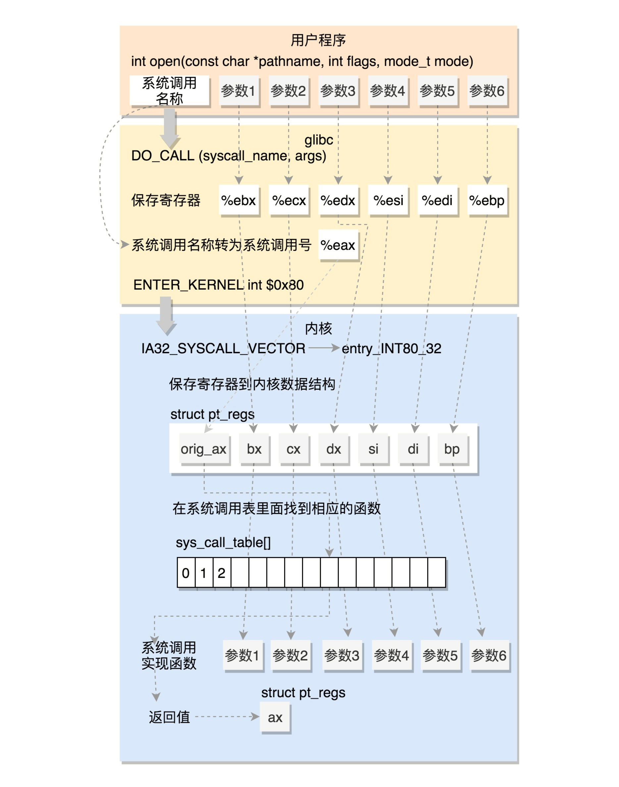

### Test

1. ABC 对D不太理解，没有使用过
2. ABC 
3. B
4. 
5. BC
6. A
7. BC
8. BD
9. C
10.
11. AD
12. BD

### 推荐书籍
OSTEP(Operating System Three Easy Picies)
Unix/Linux编程实践教程(Understanding UNIX/LINUX Programming)
程序员的自我修养-链接、装载和库
csapp深入理解计算机系统
ProgrammingwithPOSIXThreads
一个操作系统的实现

### 趣谈操作系统中的外包对应名词
* 项目运行体系 -- 祖宗进程
* 会议室 -- 内存
* 会议室管理系统 -- 内存管理系统
* 项目执计划书 -- 代码段
* 会议记录 -- 数据段
* 办事大厅 -- 系统调用
    


### 从入门到放弃-- Linux六大山坡
- 第一个坡： 抛弃旧的思维习惯， 熟练使用Linux命令行
    - 鸟哥的Linux私房菜
    - LInux系统管理技术手册
- 第二个坡：通过系统调用或者 glibc，学会自己进行程序设计
    - UNIX环境高级编程
    
- 第三个坡：了解Linux内核机制， 反复研习重点突破
    - 深入理解Linux内核

- 第四个坡：阅读Linux内核源码， 聚焦核心逻辑和场景
    - 一开始阅读代码不要纠结一城一池的得失,不要每一行都一定要搞清楚它
        是干嘛的,而要聚焦核心逻辑和使用场景
    - Linux内核源代码情景分析

- 第五个坡：实验定制化Linux组件， 已经没有人阻挡你成为内核开发工程师了
- 最后一坡：面向真实场景的开发， 实践没有终点


### 1 基本Linux命令


###  2 部分系统调用
#### 进程管理（立项服务）
1. Linux中父进程调用fork创建子进程。
2. 父进程调用fork时，子进程拷贝所有父进程的数据接口和代码过来。
3. 当前进程是子进程，fork返回0；当前进程是父进程，fork返回子进程进程号
4. 如果返回0，说明当前进程是子进程，子进程请求execve系统调用，执行另一个程序。
5. 如果返回子进程号，说明当前进程是父进程，按照原父进程原计划执行。
6. 父进程要对子进程负责，调用waitpid将子进程进程号作为参数，父进程就能知道子进程运行完了没有，成功与否。
7. 操作系统启动的时候先创建了一个所有用户进程的“祖宗进程”，课时1，第3题A选项：0号进程是所有用户态进程的祖先
* fork 创建进程
* execve 执行另一个程序的系统调用
* waitpid 父进程调用判断子进程是否执行完毕
#### 内存管理（会议室管理）
* brk 分配连续小内存
* mmap 分配连续大内存
#### 文件管理（档案资料库管理）
一切皆是文件： （程序文件（二进制文件）、文本文件、标准输入输出文件、管道文件、
Socket、设备、文件夹等皆是文件
* open 打开文件
* close 关闭文件
* creat 创建文件
* lseek 跳到文件的指定位置
* read 文件读取
* write 文件写入


#### 信号处理
* kill 终止一个进程
* sigaction 注册一个信号处理函数

####  进程通信（项目间沟通）
当进程间发送较小的信息时，使用消息队列方式，消息队列存在于内核中
* msgget 创建一个新的队列
* msgsnd 将消息发送到消息队列
* msgrcv 从队列中读取消息
当进程间需要交互的信息较大时，使用共享内存的方式，即两个项目共享了一个会议室
* shmget 创建一个共享内存块
* shmat 将共享内存映射到自己的内存控件，就可以开始读写
注： 共享内存需要注意数据竞争问题（两个进程同时读写数据），由此引出信号量机制

信号量机制Semaphore
>对于只允许一个人访问的需求，我们可以将信号量设为 1。当一个人要访问的时候，
先调用sem_wait。如果这时候没有人访问，则占用这个信号量，他就可以开始访问了。
如果这个时候另一个人要访问，也会调用 sem_wait。由于前一个人已经在访问了，
所以后面这个人就必须等待上一个人访问完之后才能访问。当上一个人访问完毕后，
会调用sem_post将信号量释放，于是下一个人等待结束，可以访问这个资源了。

#### 网络通信（公司间沟通）
不同机器间进行网络通信，需要遵循相同的网络协议,即TCP/IP网络协议栈。
Linux内核实现了网络协议栈

网络服务是通过Socket来提供服务的。Socket可以比作一个插槽，双方通信之间都需要建立一个Socket
Socket，也是一个文件，也有一个文件描述符。

#### 查看源代码的系统调用

unistd_64.h
```
#define __NR_restart_syscall	  0
#define __NR_exit		  1
#define __NR_fork		  2
#define __NR_read		  3
#define __NR_write		  4
#define __NR_open		  5
#define __NR_close		  6
#define __NR_waitpid		  7
#define __NR_creat		  8
......

```

#### glibc
##### glibc是Linux下开源标准C库
##### glibc把系统调用进一步封装

##### sys_open对应glibc的open函数
##### 一个单独的glibcAPI可能调用多个系统调用
##### printf函数调用sys_open、sys_mmap、sys_write、sys_close等等系统调用


#### 总结系统调用图
    


 


### 3 X86体系架构
#### CPU的具体构成和执行过程

- CPU 包括: 运算单元, 数据单元, 控制单元
    - 运算单元 不知道算哪些数据, 结果放哪
    - 数据单元 包括 CPU 内部缓存和寄存器, 暂时存放数据和结果
    - 控制单元 获取下一条指令, 指导运算单元取数据, 计算, 存放结果
- 进程包含代码段, 数据段等, 以下为 CPU 执行过程:
    - 控制单元 通过指令指针寄存器(IP), 取下一条指令, 放入指令寄存器中
        - 指令包括操作和目标数据
    - 数据单元 根据控制单元的指令, 从数据段读数据到数据寄存器中
    - 运算单元 开始计算, 结果暂时存放到数据寄存器
- 两个寄存器, CS存当前进程代码段和DS存数据段起始地址，保存那个进程地址，则cpu执行那个进程指令, 在进程间切换
- 总线包含两类数据: 地址总线和数据总线
---

#### x86 开放, 统一, 兼容 
##### 8086处理器

- 数据单元 包含 8个 16位通用寄存器(AX、BX、CX、DX、SP、BP、SI、DI)，
AX、BX、CX、DX可分为 2个 8位使用,H 就是 High（高位），L 就是 Low（低位）
- 控制单元 包含 IP(指令指针寄存器) 以及 4个段寄存器 CS DS SS ES
    - CS 代码段寄存器，存放代码段的起始地址，通过它找到代码在内存中的位置
    - DS 数据段寄存器，存放数据段的起始地址，通过它找到数据在内存中的位置
    - SS 栈寄存器
    - IP 存放指令偏移量
    - 数据偏移量存放在通用寄存器中
    - 地址获取： `段初始地址<<4 + 偏移量` 
 
---
##### 32 位处理器

- 通用寄存器 从 8个 16位拓展为 8个 32位, 保留 16位和 8位使用方式，名字稍有改动
- IP 从 16位扩展为 32位, 保持兼容
- 段寄存器仍为16位, 不再保存段起始地址，由段描述符(表格在内存, 缓存到 CPU 中)存储段的起始地址, 
    由段寄存器保存的是对应段在段描述符表格中的哪一项。
    - 保证段地址灵活性与兼容性
---
- 16位为实模式, 32位为保护模式
- 刚开机为实模式, 需要更多内存切换到保护模式


#### x86总结


### BIOS到bootloader，系统加载
- 实模式只有 1MB 内存寻址空间(X86)
- 加电, 重置 CS 为 0xFFFF , IP 为 0x0000, 对应 BIOS 程序
- 0xF0000-0xFFFFF 映射到 BIOS 程序(存储在ROM中), BIOS 做以下三件事:
    - 检查硬件
    - 提供基本输入(中断)输出(显存映射)服务
    - 加载 MBR 到内存(0x7c00)
- MRB: 启动盘第一个扇区(512B, 由 Grub2 写入 boot.img 镜像)
- boot.img 加载 Grub2 的 core.img 镜像
- core.img 包括 diskroot.img, lzma_decompress.img, kernel.img 以及其他模块
- boot.img 先加载运行 diskroot.img, 再由 diskroot.img 加载 core.img 的其他内容
- diskroot.img 解压运行 lzma_compress.img, 由lzma_compress.img 切换到保护模式

-----------

- 切换到保护模式需要做以下三件事:
    - 启用分段, 辅助进程管理
    - 启动分页, 辅助内存管理
    - 打开其他地址线
- lzma_compress.img 解压运行 grub 内核 kernel.img, kernel.img 做以下四件事:
    - 解析 grub.conf 文件
    - 选择操作系统
    - 例如选择 linux16, 会先读取内核头部数据进行检查, 检查通过后加载完整系统内核
    - 启动系统内核
    



### 内核初始化
- 内核初始化, 运行 `start_kernel()` 函数(位于 init/main.c), 初始化做三件事
    - 创建样板进程, 及各个模块初始化
    - 创建管理/创建用户态进程的进程
    - 创建管理/创建内核态进程的进程
---
- 创建样板进程,及各个模块初始化
    - 创建第一个进程, 0号进程. `set_task_stack_end_magic(&init_task)` and `struct task_struct init_task = INIT_TASK(init_task)`
    - 初始化中断, `trap_init()`. 系统调用也是通过发送中断进行, 由 `set_system_intr_gate()` 完成.
    - 初始化内存管理模块, `mm_init()`
    - 初始化进程调度模块, `sched_init()`
    - 初始化基于内存的文件系统 rootfs, `vfs_caches_init()`
        - VFS(虚拟文件系统)将各种文件系统抽象成统一接口
    - 调用 `rest_init()` 完成其他初始化工作
---
- 创建管理/创建用户态进程的进程, 1号进程
    - `rest_init()` 通过 `kernel_thread(kernel_init,...)` 创建 1号进程(工作在用户态).
    - 权限管理
        - x86 提供 4个 Ring 分层权限
        - 操作系统利用: Ring0-内核态(访问核心资源); Ring3-用户态(普通程序)
    - 用户态调用系统调用: 用户态-系统调用-保存寄存器-内核态执行系统调用-恢复寄存器-返回用户态
    - 新进程执行 kernel_init 函数, 先运行 ramdisk 的 /init 程序(位于内存中)
        - 首先加载 ELF 文件
        - 设置用于保存用户态寄存器的结构体
        - 返回进入用户态
        - /init 加载存储设备的驱动
     - kernel_init 函数启动存储设备文件系统上的 init
---
- 创建管理/创建内核态进程的进程, 2号进程
    - `rest_init()` 通过 `kernel_thread(kthreadd,...)` 创建 2号进程(工作在内核态).
    - `kthreadd` 负责所有内核态线程的调度和管理
    
### Linux系统调用的原理
- glibc 将系统调用封装成更友好的接口
- 本节解析 glibc 函数如何调用到内核的 open
---
- 用户进程调用 open 函数
    - glibc 的 syscal.list 列出 glibc 函数对应的系统调用
    - glibc 的脚本 make_syscall.sh 根据 syscal.list 生成对应的宏定义(函数映射到系统调用)
    - glibc 的 syscal-template.S 使用这些宏, 定义了系统调用的调用方式(也是通过宏)
    - 其中会调用 DO_CALL (也是一个宏), 32位与 64位实现不同
---
- 32位 DO_CALL (位于 i386 目录下 sysdep.h)
    - 将调用参数放入寄存器中, 由系统调用名得到系统调用号, 放入 eax
    - 执行 ENTER_KERNEL(一个宏), 对应 int $0x80 触发软中断, 进入内核
    - 调用软中断处理函数 entry_INT80_32(内核启动时, 由 trap_init() 配置)
    - entry_INT80_32 将用户态寄存器存入 pt_regs 中(保存现场以及系统调用参数), 调用 do_syscall_32_iraq_on 
    - do_syscall_32_iraq_on 从 pt_regs 中取系统调用号(eax), 从系统调用表得到对应实现函数, 取 pt_regs 中存储的参数, 调用系统调用
    - entry_INT80_32 调用 INTERRUPT_RUTURN(一个宏)对应 iret 指令, 系统调用结果存在 pt_regs 的 eax 位置, 根据 pt_regs 恢复用户态进程

---
- 64位 DO_CALL (位于 x86_64 目录下 sysdep.h)
    - 通过系统调用名得到系统调用号, 存入 rax; 不同中断, 执行 syscall 指令
    - MSR(特殊模块寄存器), 辅助完成某些功能(包括系统调用)
    - trap_init() 会调用 cpu_init->syscall_init 设置该寄存器
    - syscall 从 MSR 寄存器中, 拿出函数地址进行调用, 即调用 entry_SYSCALL_64
    - entry_SYSCALL_64 先保存用户态寄存器到 pt_regs 中
    - 调用 entry_SYSCALL64_slow_pat->do_syscall_64
    - do_syscall_64 从 rax 取系统调用号, 从系统调用表得到对应实现函数, 取 pt_regs 中存储的参数, 调用系统调用
    - 返回执行 USERGS_SYSRET64(一个宏), 对应执行 swapgs 和 sysretq 指令; 系统调用结果存在 pt_regs 的 ax 位置, 根据 pt_regs 恢复用户态进程

---
- 系统调用表 sys_call_table
    - 32位 定义在 arch/x86/entry/syscalls/syscall_32.tbl 
    - 64位 定义在 arch/x86/entry/syscalls/syscall_64.tbl
    - syscall_*.tbl 内容包括: 系统调用号, 系统调用名, 内核实现函数名(以 sys 开头)
    - 内核实现函数的声明: include/linux/syscall.h
    - 内核实现函数的实现: 某个 .c 文件, 例如 sys_open 的实现在 fs/open.c
        - .c 文件中, 以宏的方式替代函数名, 用多层宏构建函数头
    - 编译过程中, 通过 syscall_*.tbl 生成 unistd_*.h 文件
        - unistd_*.h 包含系统调用与实现函数的对应关系
    - syscall_*.h include 了 unistd_*.h 头文件, 并定义了系统调用表(数组)
- 64位系统完整调用执行过程


## 进程管理
### 线程的并发执行
#### 为什么要有线程?
将任务拆解，同时运行。
#### 如何创建线程?

#### 线程的数据
我们将线程访问的数据分为三类
1. 线程上的本地数据，比如函数内创建的局部变量
2. 进程里的共享的全局变量
3. 线程里创建的私有变量
>int pthread_key_create(pthread_key_t *key, void (*destructor)(void*))


#### 数据的保护
多线程如何操作共享数据，并保证数据的一致性和准确性
1. Mutex(Mutual Exclusion)，中文名叫互斥。即通过一把互斥锁，多个线程同时去
抢占这把锁，线程A抢占成功则继续运行，其他线程如线程B抢占失败则阻塞直到线程A释放互斥锁。

2. 条件变量和互斥锁。再没有任务是，多个线程都处于休眠状态，一旦任务出现，会对应通知其他休眠线程，
线程则开始抢占任务，抢占成功则继续运行，抢占失败则继续进行休眠。知道下次任务出现发出通知

什么需要条件变量？互斥锁本身好像就能保护数据不被篡改和破坏。

其实，互斥所的确能够保证数据的准确性，只是，他再某些条件下会造成CPU的消耗。

假设有这么一个场景：

有一个任务队列，里面存储这若干任务。有ABCD四个线程需要轮流从任务队列里取出任务来执行。
生产任务者会不定期向任务队列里添加任务。这是怎样做能够保证同一个任务不被两个人同时领取？

第一肯定是上锁，拿到锁的线程操作任务队列取出数据后释放锁，由下个线程加锁从队列中获取数据。
这样能够保证每个任务只有一个线程再运行，从而起到保护效果。但是，当任务队列里面没有任务，
而空闲线程会不断的处于获取锁，查看任务队列，没有任务，释放锁的过程，这样会消耗CPU的资源。

第二个解决办法就是，加上条件变量。开始时操作相同，多个线程抢占锁，拿到锁的线程
操作任务队列取出数据后释放锁，由下个线程加锁从队列中获取数据。当某个线程抢占锁后发现没有任务，
则进入休眠并释放锁，等待生产者重新向任务队列添加任务。其他线程任务执行完毕后同样再次抢占锁
查看任务队列，发现没有任务后同样进入释放锁进入休眠状态。当生产者添加任务时，同时唤醒休眠线程
继续抢占锁来处理任务。

第二个解决办法实际上时处于被动通知的状态，再没有任务时所有的线程都处于休眠，降低了占用CPU的时间
从而提高了利用率，而第一种方法则会不断的主动判断任务队列是否有任务，处于不断加锁，检查条件，释放锁
的过程，占用了CPU。导致效率低下。

#### 总结
1. 当操作共享数据，一定要使用锁。
2. 当不定时出现任务时，可以时用条件变量加互斥锁，被动通知的去处理任务
3. 条件变量的使用应该也是有场景的，它主要是为了避免线程一直竞争锁而导致cpu占用高，
但是它也是有代价的，线程被唤醒也是要消耗cpu资源的。其实如果老板一直发任务，
不会间隔很长时间才发新任务的话，只用互斥锁就可以了
4. 线程的使用总结


